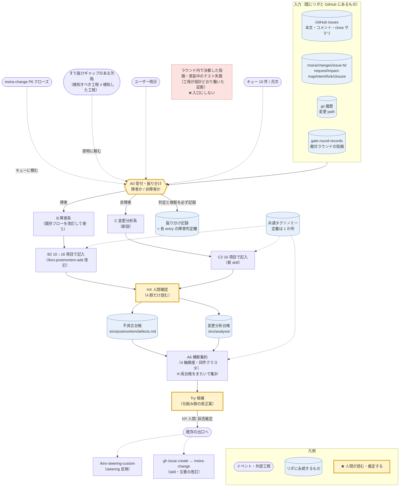
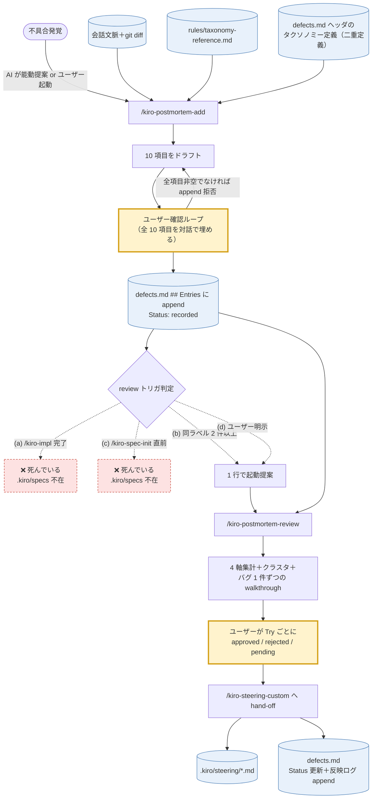
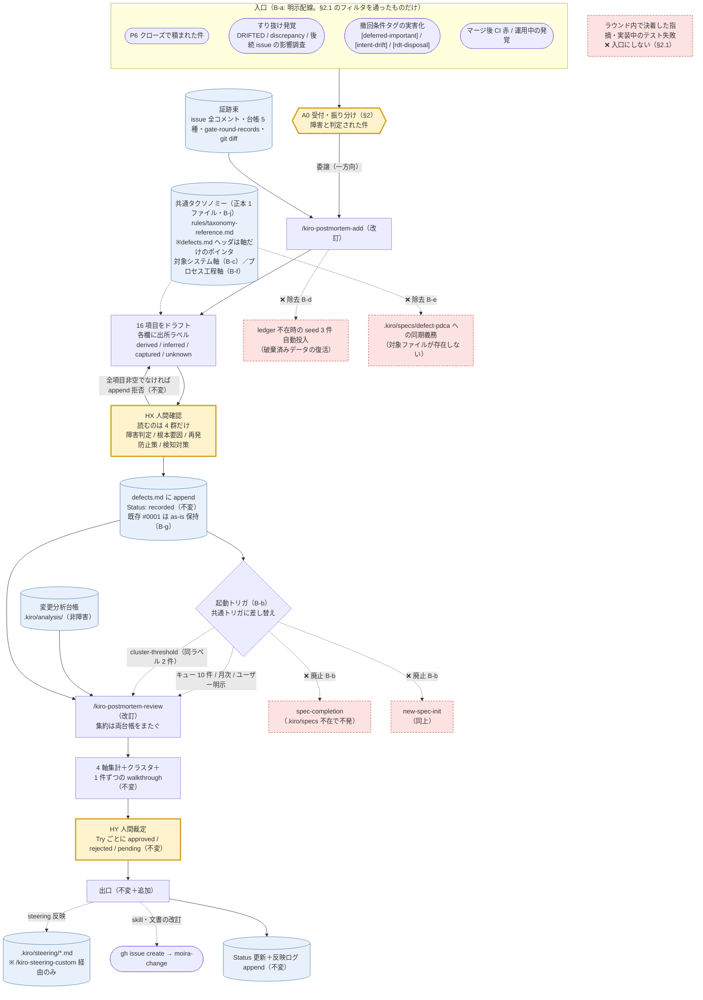

# Moira 要因分析フロー DFD（ドラフト v3）

> **状態**: **draft v3**（2026-07-25。**人間承認待ち**——issue #19 本文の順序拘束「まず DFD をつくって
> ユーザーの承認を得てから実装に移ること」に従い、本ドラフトの承認前に実装成果物〔skill・台帳・steering〕を作らない）
> **対象 issue**: [#19](https://github.com/PrimeBrains/moira/issues/19)
> **v1 → v2 の差分**（HA 第 1 ラウンドのユーザー裁定を反映）: ①**障害／非障害を最初に振り分ける受付工程（A0）を新設**
> ②**既存の障害フロー（`/kiro-postmortem-add` ／ `/kiro-postmortem-review`）も as-is で DFD に起こし、
> 実地監査で見つかった欠陥と改訂案を §3 に明示**（「既存の障害フローも正しいか自信がないので描いて考えたい」）
> ③起動トリガの閾値を未分析 10 件へ ④変更範囲の語彙は既存 7 値に統一 ⑤欠落 7 項目は AI 推論＋人間確認、
> 一次採取は 2 欄のみ追加
> **v3 → v4 の差分**（`doc-refine` ラウンド 1・独立の敵対レビューと事実検証の指摘を反映）: ①**「17 項目」は誤りで
> 実体は 16 項目**（issue #19 本文の列挙も 16）——全箇所を訂正 ②**既存台帳は 15 本ではなく、本リポのクローズ済み
> 13 本**（`issue-39/42/43` はいずれも旧リポ番号）③タクソノミー正本を 1 ファイルに確定した裁定（B-j）を、
> to-be 図・フォルダ構成・保存先表にも反映（3 箇所が「2 ファイル同期」のままだった）④入口フィルタの適用範囲を
> 「欠陥検出を契機とする追加投入のみ」に限定（クローズ由来の母集団は間引かない）⑤すり抜け検出の永続先を明記
> ⑥トリガ ID を steering に一本化（`cluster-threshold` を含む 6 個）⑦F1 の証拠出典を訂正（#16 に
> `gate-round-records.md` は無い——実出典は同 issue の閉包レポート）
>
> **v2 → v3 の差分**（HA 第 2 ラウンドのユーザー裁定を反映）: **欠陥検出を入口にする範囲を「すり抜けギャップの
> あるもの」に限定**した（§2.1 新設・§7 (d) 改訂）。v2 は「ゲート／CI／検知器の検出」を無条件に入口にしており、
> **実装中の試行錯誤まで母集団に入って集計が意味をなさなくなる**穴があった（ユーザー指摘）。判定は既存スキーマの
> 項目 13/14 のギャップで行い、新しい基準を発明しない。
> **位置づけ**: 変更管理フロー（[`.kiro/steering/moira-change-management.md`](../../.kiro/steering/moira-change-management.md)）が
> **変更を通す**工程列であるのに対し、本フローは**通り終えた変更を振り返る**工程列である。前者の出口（P6 クローズ）が
> 後者の入口になる。既存ゲート・既存の委譲辺は変更しない。
> **先例**: [`moira/plans/2026-07-19-change-management-dfd.md`](2026-07-19-change-management-dfd.md)（変更管理 DFD）と同じ体裁。
> **一次観測**: 設計根拠の実地監査（既存台帳 13 本・16 項目の導出可能性／既存障害フローの現況）は
> [`moira/changes/issue-19/impact-map.md`](../changes/issue-19/impact-map.md) §前提調査と本書 §3.2 が持つ。

## 0. 一文の定義とスコープ

**要因分析フローとは、クローズ済みの変更 1 件（GitHub issue ＋ `moira/changes/issue-N/` 台帳 ＋ 実差分）を
単位に、まず「障害か非障害か」を受付で振り分け、障害は既存の不具合台帳へ・非障害は変更分析台帳へ——
どちらも共通の項目定義とタクソノミーで——分析票を起こし、「①履歴からの導出／②AI 推論／③フロー実行時の採取」の
三系統で、埋められない欄は埋められないと記録したまま埋め、同件を横断集約して、仕組み（skill・steering）側の
是正 Try に落とす工程列である。**

### スコープの正直な宣言（先に限界を書く）

1. **全項目の自動充填は成立しない。** 実地監査の結論（**2026-07-25 以前にクローズされた変更**についての観測。
   同日以降は §8 の一次採取で 2 欄が `captured` になる）: 16 項目のうち**7 項目は既存の入力にそもそも存在しない**
   （障害判定・変更分類・根本要因・再発防止策・検知すべき工程・検知できなかった理由・検知対策）。
   本フローは**AI 推論＋人間確認**で埋め、**各欄に出所ラベルを必須**とする（§5.1）。
   「履歴を読めば全部わかる」とは主張しない。
2. **本フローは検証器（計器）ではない。** 事後分析であり、変更を止める権限も合否も持たない。
   計器①〜⑥（`moira-verification.md`）にも変更管理フローのゲート群にも**加わらない**。
3. **過去分は「当時の判断の記録」ではなく「事後の再構成」である。** クローズ済み issue の障害判定・検知工程は
   当時どこにも記録されていない——起こすのは後知恵の再構成であり、台帳はそれを明示する（`inferred` ラベル）。
4. **同件調査の網羅性は保証しない。** 台帳の見出しには実際に表記ゆれがあり、抽出は regex ではなく意味検索に依る。
   見落としは残る——`decision-conformance` の意味突合と同じ正直枠。
5. **「定期的」を外部スケジューラで強制はしない。** 起動トリガの**規約**を定義するところまでが本フローで、
   cron 等の配線は含めない（§7）。
6. **既存の障害フローの改訂は「配線の是正」までとし、PDCA 思想そのものは変えない**（§3.3）。

## 1. 全体 DFD



**要点**:

- **入口は 1 つ（A0）**——障害も非障害もここを通る。**振り分けの判定と根拠が必ず記録される**
  （現行は「不具合として記録するかどうか」が skill を起動するか否かの暗黙判断で、「非障害と判定した」記録が
  どこにも残らない＝振り分けが監査不能。§3.2 F8）。
- **台帳は 2 つ（別管理）**——障害＝既存の不具合台帳、非障害＝新設の変更分析台帳。
- **項目定義とタクソノミーは共通（1 か所）**——別管理でも横断集計ができるように。
- **人間タッチポイントは 2 点**: **HX**（分析票の 4 群だけ確認）と **HY**（Try の採否裁定）。
- **新造ゲートを作らない**——合否判定器を持たない（steering §0 と同じ紳士協定）。

## 2. A0 受付・振り分け（新設・共通入口）

| 項目 | 内容 |
|---|---|
| **in** | (i) `moira-change` P6 クローズ（→キューに積むだけ・分析は走らせない）(ii) **すり抜けギャップのある欠陥検出のみ**（§2.1 のフィルタを通ったもの）(iii) ユーザー明示 (iv) キュー閾値・定期 |
| **処理** | ①母集団を **repo 修飾キー**（`moira#16`）で列挙し、両台帳の index に無いものを未分析キューへ ②各件について**障害／非障害を判定**する（AI がドラフト、HX で人間が確定）③障害→B 系、非障害→C 系へ振り分ける |
| **out** | 未分析キュー＋**振り分け判定（判定・根拠・出所ラベル）** |
| **判定基準（ドラフト）** | **障害** = 「意図した仕様・約束されたふるまいから外れた状態が実在した」変更（バグ FIX・欠陥是正・回帰）。潜在（未発現）欠陥も**障害**に含める〔例: #16 の torn write は誰にも観測されていないが仕様違反状態は実在した〕。**非障害** = 要件追加・要件変更・リファクタリング・テスト追加・運用変更・仕組み改善・文書のみ |
| **境界事例の扱い** | 判定が割れる件は `障害` 側に倒し、理由を記録する（見落としより過剰記録を選ぶ）。**判定を覆した履歴も残す** |

> **なぜ受付を分けるか**: 「障害と非障害で台帳を分ける」なら、**分ける行為そのものが 1 つの工程**であり、
> その判定は記録されなければ後から検証できない。振り分けを暗黙にすると「非障害と判断して記録しなかった」件が
> 母集団から黙って消える——変更管理フローの「黙って落ちる波及先を作らない」と同じ原理の自己適用。

### 2.1 入口フィルタ——「すり抜けギャップ」基準（裁定済み・v3。**適用範囲は v4 で限定**）

> **適用範囲（v4 訂正）**: 本フィルタが掛かるのは **欠陥検出を契機とする追加投入**だけである。
> **P6 クローズ由来の母集団（§9）には掛からない**——クローズした変更は障害・非障害を問わず全件が分析対象。
> また判定に使う工程は**投入時点では暫定判定でよい**（分析後に §5 の項目 13/14 として確定する）——
> でなければ「分析しないと投入可否が決まらない」循環になる。

**検出の主体（誰が見つけたか）では線を引かない。** ゲート・CI・検知器の検出をすべて入口にすると、
**実装中の試行錯誤（round1 の指摘 → round2 で修正、赤いテストを直しながら進む等）まで母集団に入り、
集計が意味をなさなくなる**。線を引くのは**すり抜けの有無**である。

> **判定式**: **「検知すべき工程」≠「実際に検知した工程」**（＝下流にずれた）**なら入口へ。等しければ入口にしない。**
> これは既存スキーマの項目 13/14（§5）そのものであり、**新しい基準を発明しない**。

| 事象 | 入口か | 理由 |
|---|---|---|
| 敵対ゲートの round1 で Critical/Important が出て round2 で決着 | **入口にしない** | そのラウンドは元々それを捕まえるための工程。ギャップなし＝**工程が設計どおり働いた証拠** |
| 実装中のテスト失敗・レビュー指摘・型エラー | **入口にしない** | 同上（`ci`／`gate-adversary` が設計どおり機能） |
| P5 閉包で未マップ差分が見つかり P2 へ差し戻し | **入口にしない** | P5 は元々それを捕まえる工程 |
| **クローズ済み変更の欠陥が、後の issue の影響調査・`decision-conformance` の DRIFTED・E2E の discrepancy で発覚** | **入口** | 本来は当該変更の工程内で捕まえるべきだった＝**すり抜け**（実例: #15 の是正漏れが #16 の P2 で発覚） |
| **deferred Important／`[intent-drift]`／`[rdt-disposal]` の実害化** | **入口** | 既存の撤回条件タグ規律がまさにこれを数えるために存在する |
| **main マージ後の CI 赤・運用中の発覚** | **入口** | 全工程をすり抜けた（`post-close`） |

**運用上の含意**: どの入口であっても **AI はキューに積むだけ**で、都度「起票しますか？」とは聞かない
（起動は §7 のトリガ＝キュー 10 件／月次／明示に従う）。実績母集団での見積もりは、直近 15 issue で**数件**規模。

## 3. B 障害系フロー（既存）——as-is と改訂案

### 3.1 as-is DFD（現況・実装どおり）



### 3.2 実地監査で見つかった欠陥（すべて現物で確認済み）

| ID | 欠陥 | 確認方法・証拠 | 重大度 |
|---|---|---|---|
| **F1** | **入口が変更管理フローと繋がっていない。** 敵対ゲートの Critical/Important 指摘・`decision-conformance` の DRIFTED・E2E の discrepancy・CI 失敗が不具合台帳へ流れる配線がない | `defects.md` の entry は **#0001（2026-07-05）の 1 件のみ**。以後クローズした変更管理 issue は **13 本**（`gh issue list --state closed`）あり、その台帳には Critical/Important の実指摘が記録されている（例 #16: `moira/changes/issue-16/closure-report.md`「M 面＝round2 で 1 Important」「D 面＝round2 で 1 Critical」。※#16 に `gate-round-records.md` は無く、出典は閉包レポート。同ファイルを持つのは本リポ 8 本）が、**postmortem entry は 1 件も増えていない** | **Critical** |
| **F2** | **`.kiro/specs` 不在に依存した死んだ配線が 3 つ。** ①発生機能タクソノミーは「ラベルは `.kiro/specs/moira-*` の feature 名から採る」と規定 ②トリガ (a) `spec-completion`（`/kiro-impl` 完了＝tasks 全 `[x]`）③トリガ (c) `new-spec-init` | `.kiro/` 直下に **`specs` ディレクトリ自体が存在しない**（R/D/T 使い捨て化・issue #40 の帰結）。出典は `defects.md` ヘッダ「発生機能タクソノミー」節・`rules/trigger-detection.md`・`SKILL.md`／**`SKILL.ja.md` の両方**（両ファイルは並行翻訳であり、片方だけの是正では不整合が残る）。**4 トリガのうち 2 つが構造的に発火しない**——起動は事実上 (b) と (d) のみに縮退 | **Important** |
| **F3** | **skill が破棄済みの seed を復活させる。** `defects.md` ヘッダは「Moira への切り替えに伴いリセット済み（旧プロトタイプ由来の entry は破棄）」と宣言するが、`/kiro-postmortem-add` Step 2 は **ledger 不在時に seed 3 件を投入**する手順のまま | `SKILL.md` Step 2「`templates/seed-entries.md` の 3 件 seed body を取得…seed #0001-#0003 がすべて `Status: recorded` で含まれる」＋**`SKILL.ja.md` 同 Step（同一記述）** vs `defects.md` ヘッダの破棄宣言。**台帳を作り直すと破棄したはずのデータが蘇り、現行 entry #0001 と Entry ID が衝突する** | **Important** |
| **F4** | **存在しないファイルへの同期義務。** タクソノミー拡張時に「`.kiro/specs/defect-pdca/requirements.md` の AC.1 も更新してください」と通知する（3 ファイル同期規律の 1 つ）。あわせて Critical Constraints の「既存 spec 不変（`.kiro/specs/{core-data-model,evm-engine,progress-tracking,dashboard}/`）」も**存在しないディレクトリ**を守っている | 当該 spec は存在しない（`.kiro/specs` ごと不在）。`SKILL.md` Step 4・`SKILL.ja.md` 同 Step の**両方**。**規律の 1/3 が死んでいる** | Important |
| **F4′** | **10→16 項目化で既存 entry が集計から黙って消える危険（本 issue が作り込みうる欠陥）。** `/kiro-postmortem-review` Step 2 は「必須 10 項目のいずれかが欠ける → malformed → ID 報告のうえスキップ」と規定する。項目を 17 に上げつつ既存 #0001 を as-is 保持（B-g）すると、**唯一の既存 entry が malformed 判定でスキップされる** | `kiro-postmortem-review` SKILL.md／SKILL.ja.md Step 2 の malformed 判定条件と、B-g（遡及書き換え禁止）の組み合わせ | **Critical**（作り込み防止） |
| **F5** | **検知工程タクソノミーが V モデル前提**（`code-review`/`unit-test`/`integration-test`/`e2e`/`manual-verification`/`production`/`user-report`）で、本リポの実工程（P2 影響調査・HA・敵対ラウンド・独立採点・P5 閉包・codex レビュー）を表す語がない | entry #0001 の「検知した工程」は `manual-verification` だが、実際の検知点は「後続コマンドの 404 → node ID 突合」であり工程名としては**クローズ後の発覚**に近い。**ラベルが実態を表せていない** | Important |
| **F6** | **旧プロトタイプの残骸。** 推論例のパスが `evm-studio/client/src/lib/formatters.ts`（旧プロダクト） | SKILL.md Step 3 の表 | Minor |
| **F7** | **`cluster-threshold`（同ラベル 2 件）は entry 1 件では発火しない**——F1 と合わさり、review が起動する現実的な契機が (d) ユーザー明示のみになっている | `defects.md` の `## Steering 反映ログ` は**空**（review が一度も完走していない） | Important |
| **F8** | **障害判定そのものが記録されない。** 「不具合として記録するか」は skill を起動するか否かの暗黙判断で、「非障害と判定した」記録が残らない | `defects.md` のスキーマに障害判定欄がない。→ **A0 受付（§2）で解消** | Important |

### 3.3 改訂案（to-be）——「配線の是正」に絞り、PDCA 思想は変えない

| ID | 改訂 | 対応する欠陥 |
|---|---|---|
| **B-a** | **入口を A0 に一本化**し、P6 クローズと**すり抜けギャップのある欠陥検出**（§2.1 のフィルタ通過分——DRIFTED・discrepancy・後続 issue の影響調査での発覚・deferred/intent-drift の実害化・マージ後 CI 赤）を A0 のキュー投入契機として**明示配線**する。**ラウンド内で決着した指摘は配線しない**（母集団を試行錯誤で汚さない） | F1 |
| **B-b** | **死んだトリガ (a)(c) を廃止**し、共通トリガ（§7: キュー 10 件／月次／P6 クローズで積む／明示）へ差し替える。`cluster-threshold` は集約側の契機として維持 | F2・F7 |
| **B-c** | **発生機能タクソノミーの出所を差し替え**: `.kiro/specs/moira-*` の feature 名 → **対象システム**（`backend`/`frontend`/`cli`/`adapter`/`process`）＋自由サブスコープ | F2 |
| **B-d** | **seed 投入手順を削除**（ledger 不在時は空 ledger を作る）。`templates/seed-entries.md` は廃止または「参考例（投入しない）」へ降格 | F3 |
| **B-e** | **`.kiro/specs/defect-pdca/requirements.md` への同期義務を削除**（同期は ledger ヘッダ＋`taxonomy-reference.md` の 2 ファイル） | F4 |
| **B-f** | **検知工程タクソノミーにプロセス軸を追加**（§6。V モデル軸と併存） | F5 |
| **B-g** | **項目を 10 → 17 に拡張**（C 系と共通様式）。**既存 entry #0001 は as-is 保持**（遡及書き換えをしない——欠落欄は `unknown` として集計側で扱う） | — |
| **B-h** | 旧プロトタイプのパス例を現行の実パスへ差し替え | F6 |
| **B-i** | **パーサを 2 スキーマ受理にする**（`/kiro-postmortem-review` Step 2）: entry に `Schema: v1`（10 項目）／`v2`（16 項目）メタを持たせ、**v1 entry は malformed にせず、欠落項目を `unknown` として集計に載せる**。`Schema:` 欠落の既存 entry は **v1 とみなす**（#0001 を書き換えずに済む） | F4′ |
| **B-j** | **タクソノミー正本の一本化**（§6）: `rules/taxonomy-reference.md` を**正本**とし、`defects.md` ヘッダは**要約＋正本へのポインタ**に降格する。「single source of truth と言いながら 2 ファイル同期」という F4 と同型の矛盾を残さない | F4 と同型の構造 |
| **B-k** | **撤回条件の literal タグ規律を 16 項目化後も維持**（項目 8「根本要因」へ明示的に継承）: `[deferred-important]`／`[rdt-disposal]`／`[intent-drift]` を該当時に本文へ含める。これらは `moira-change-management.md` §6 と `moira-verification.md` の撤回条件が **grep で数える計器**であり、書き換えで落とすと**別の機構の計器が黙って死ぬ** | 作り込み防止 |

> **改訂しないもの（意図的）**: PDCA の 4 フェーズ構成、Status 3 値（`recorded`/`reviewed`/`steered`）、
> append-only 規律、全項目非空での append 拒否、`/kiro-steering-custom` 経由でのみ steering を触る規律、
> ユーザー確認なしに append/起動しない規律。**これらは健全であり触らない。**

### 3.4 to-be DFD（改訂後の障害系フロー）



**as-is（§3.1）との差分の読み方**: 赤い破線ノードは**除去・廃止されるもの**（seed 自動投入・死んだ
2 トリガ・存在しない spec への同期義務・入口にしない事象）。太字の追加は**入口の明示配線（B-a）**・
**16 項目化（B-g）**・**タクソノミーの出所差し替えとプロセス軸追加（B-c/B-f）**・**集約が両台帳をまたぐこと**。
`recorded`→`reviewed`→`steered` の Status 遷移、全項目非空での append 拒否、`/kiro-steering-custom` 経由でのみ
steering を触る規律、ユーザー確認なしに起動しない規律は**図のとおり不変**である。

## 4. C 変更分析系フロー（新設）

| 工程 | in | 処理 | out |
|---|---|---|---|
| **C2-a 証跡収集** | A0 が振り分けた非障害 1 件 | issue 本文・**全コメント**（triage/HA/閉包サマリはここにある）・台帳 5 種＋補助 md（`gate-round-records.md` 等）・`git diff --name-only`・関連する既存 entry を集める | 証跡束（各断片に**出典パス／URL**） |
| **C2-b 導出** | 証跡束 | 履歴に**在る**項目を写す: 対象システム（変更 path→システム写像）・変更範囲（影響マップのクラス列）・同件調査対象（母集団定義）・同件の対応状況（派生/追跡 issue リンク）・実際に検知した工程（`gate-round-records.md` の指摘ラウンド） | 一次記入票（`derived`＋出典） |
| **C2-c 推論** | 一次記入票＋証跡束 | 履歴に**在らざる**項目を埋める（事象・変更分類・発生原因・**根本要因〔仕組み帰責を必ず一度は問う〕**・再発防止策・検知系 3 項目）。**根拠を示せない欄は `unknown`（捏造禁止）** | 分析票ドラフト |
| **HX 人間確認** | 分析票ドラフト | 人間が読むのは **4 群だけ**: ①障害判定 ②根本要因（仕組み帰責）③再発防止策 ④検知対策 | 批准済み entry（1 件 1 ファイル） |
| **A6 横断集約** | **両台帳**の全 entry | 4 軸（変更分類 × 根本要因 × 対象システム × 検知工程ギャップ）の頻度と同件クラスタ → **Try 候補** | 集約レポート＋Try 候補 |
| **HY Try 裁定** | Try 候補 | 採否を人間が裁定。採用分は**既存の出口**へ（`/kiro-steering-custom` ／ issue 起票→`moira-change`）——**本フローは自分で確定文書を書き換えない** | 反映済み Try |

## 5. 分析票の項目定義（16 項目・B/C 共通）

| # | 項目 | 既定の充填系統 | 語彙／様式 |
|---|---|---|---|
| 1 | 対象システム | derived | 正本 R13 の 6 ラベル（`backend` / `frontend` / `cli` / `adapter` / **`process`**〔skill・steering・確定文書・台帳〕/ `other`）。**`process` を追加**——プロセス側だけを変える変更が実在（#1/#5/#10/#19）。複数可 |
| 2 | 事象 | inferred（素材は derived） | Given / When / Then ＋**期待値／実際値**。非障害では「Then＝変更後にこうなる」 |
| 3 | 障害判定 | **A0 で判定 → HX で人間確定** | `障害` / `非障害`＋根拠。**振り分けの正本**（§2） |
| 4 | 変更分類 | inferred | `req-change` / `req-add` / `refactor` / `bugfix` / `test-add` / `ops-change` / `process-improve` / `doc-only` / `other` |
| 5 | 変更範囲 | derived | 影響マップのクラス列。**M/D/P/S/C/V/F の 7 値**（既存語彙に統一・裁定済み） |
| 6 | 発生原因サマリ | inferred | **専門用語なし**の平易文 1〜2 文 |
| 7 | 発生原因詳細 | inferred（素材は derived） | 技術者向け・出典パス付き |
| 8 | 根本要因 | inferred → **HX 確定** | **仕組み帰責を必ず一度は問う**（SKILL / steering / テンプレート / 工程配線 / タクソノミー / 人間タッチポイント設計に穴がなかったか）＋既存の根本要因分類ラベル 1 つ。**撤回条件の literal タグを維持**（B-k）——該当時は `[deferred-important]`／`[rdt-disposal]`／`[intent-drift]` を本文に含める（他機構の撤回条件が grep で数える計器） |
| 9 | 同件調査対象 | derived | 走査した母集団の明示。**範囲を書かない「該当なし」を認めない** |
| 10 | 同件調査結果 | inferred（意味検索） | 有無＋該当キー。**網羅性は保証しない** |
| 11 | 同件の対応状況 | derived | 別 issue のキー＋リンク＋state。`gh issue view` で機械照合 |
| 12 | 再発防止策 | inferred → **HX 確定** | **出口を名指す**（steering / skill / テンプレート / 計器） |
| 13 | 検知すべき工程 | inferred | §6 の拡張タクソノミー |
| 14 | 実際に検知した工程 | derived（`gate-round-records.md`）／無ければ inferred | §6 の拡張タクソノミー |
| 15 | なぜ然るべき工程で検知できなかったか | inferred → **HX 確定** | 13≠14 なら必須 |
| 16 | 検知するための対策 | inferred → **HX 確定** | 計器・ゲート・チェックリストのどれを足すか名指す |

**メタ欄**: `key`（repo 修飾）／`analyzed-at`／`status`（`drafted`→`ratified`→`aggregated`）／`sources`／各欄の出所ラベル。

### 5.1 出所ラベル（正直枠の中核）

| ラベル | 意味 |
|---|---|
| `derived` | 履歴（issue・台帳・git）から写した。**出典パス／URL 必須** |
| `inferred` | AI が推論した。**根拠（どの記述から）必須**・後知恵の再構成 |
| `captured` | 変更管理フローの実行時に採取された一次記録（§8 の 2 欄のみ） |
| `unknown` | 埋められない。**空欄・推測での穴埋めを禁じる**——「わからない」を記録する |

## 6. タクソノミー（定義は 1 か所）

**正本は `.claude/skills/kiro-postmortem-add/rules/taxonomy-reference.md` の 1 ファイル**（B-j）。
`.kiro/postmortem/defects.md` ヘッダは**要約＋正本へのポインタ**に降格する——「single source of truth」と称しながら
2 ファイルを同期義務で結ぶのは、F4 で批判した「同期義務つき複製」を 1 つ減らしただけで同型の欠陥だからである
（既存 `/kiro-postmortem-review` Step 1 が既に `taxonomy-reference.md` を有効ラベル定義として読んでおり、正本化は
現行の実挙動と整合する）。C 系は同じ正本を**参照**し、不足軸は**正本に追記**する。

| 軸 | 扱い |
|---|---|
| 要因分類（What） | 既存をそのまま再利用 |
| 根本要因分類（Why） | 既存をそのまま再利用（項目 8 の「仕組み帰責」は散文で補う） |
| 発生機能（Spec 軸） | **出所を差し替え**（B-c）——対象システム 6 ラベル（`other` を含む）＋自由サブスコープ |
| 検知工程（Where 軸） | **プロセス軸を追加**（下記・V モデル軸と併存） |
| 変更分類 | **新設**（§5 #4） |

**検知工程タクソノミーの拡張（プロセス軸）**:

| Label | 定義 |
|---|---|
| `p1-triage` | 変更管理フロー P1 受付・triage |
| `p2-impact-survey` | P2 影響調査（波及先の列挙漏れはここで検知すべき） |
| `ha-ratification` | HA 前半集約セッション（意図・境界の誤り） |
| `gate-adversary` | 各ゲートの敵対レビュー（`doc-adversary`／`moira-adversary`／codex） |
| `gate-judge` | 独立採点・独立照合（`doc-gate-judge`／`moira-gate-judge`／`decision-conformance`／`e2e-scenario-checker`） |
| `p5-closure` | P5 同期閉包確認（未マップ差分・deferred 要件） |
| `ci` | CI（計器①②③④） |
| `post-close` | クローズ後の発覚（全工程をすり抜けた状態） |

## 7. 起動トリガ（「定期的に」の実装・B/C 共通）

**既定は手動起動＋AI からの 1 行提案**（**AI はユーザー確認なしに分析を起動しない**——既存 R9.3/R9.6 の規律を踏襲）。

| ID | トリガ | 検出契機 | AI 提案 |
|---|---|---|---|
| (a) | `queue-threshold` | 未分析キューが **10 件**以上（裁定値） | ✅ |
| (b) | `cluster-threshold` | 未レビュー entry で同じ根本要因／要因分類が 2 件以上（既存 PDCA の契機を維持・B-b） | ✅ |
| (c) | `periodic` | 前回の**横断集約**から **1 か月**経過（集約が一度も無いときは発火しない） | ✅ |
| (d) | `post-close` | `moira-change` P6 クローズ——**分析は走らせない**。キューは算出値ゆえ「積む」操作は実体を持たない（正直開示） | ❌ |
| (e) | `escaped-defect` | **すり抜けギャップのある欠陥**（§2.1 通過分）を検出——**その場で `INDEX.md` の「すり抜け検出ログ」に 1 行残す**（キューは算出値なので、記録しないと観測が消える） | ❌ |
| (f) | `user-explicit` | ユーザー明示（常時許容） | ❌ |

**廃止**: 旧 (a) `spec-completion`・旧 (c) `new-spec-init`（`.kiro/specs` 不在で構造的に発火しない。§3.2 F2）。
**cron 等の外部スケジューラは配線しない**（§0-5）。

## 8. フロー実行時の一次採取（2 欄のみ・裁定済み）

`moira-change` の **P6 クローズ時**に、閉包レポート（または issue クローズコメント）へ次の 2 欄だけを追加する:

1. **障害判定**（`障害` / `非障害`＋一言の根拠）
2. **変更分類**（§5 #4 の 9 値から 1 つ）

**それ以外は採取しない**——検知工程・根本要因まで実行時に書かせるとクローズ工程が重くなり、
ratified steering の改訂範囲も大きくなるため（裁定済み）。過去 13 本は採取不能なので、
いずれにせよ推論経路（§5.1 `inferred`）は必須である。

## 9. 母集団とキー規約

- **キー**: `<repo>#<number>`（例 `moira#16`）。**無修飾の `#N` を禁じる**——`moira/changes/issue-39/42/43` は
  旧リポ `PrimeBrains/sdd-workshop` の番号であり本リポの同番号と**衝突しうる**（本リポの最大 issue 番号は現在 #19 ゆえ実衝突は未発生・`issue-43/request.md` の原文リンクで旧リポ由来を確認済み）。
  **これは新判断ではなく既存 D-80（「移管前文書中の `#N` は旧リポ番号を指す——読み替え方針は canonical に置き、
  本文は書き換えない」・`agreed`）の本台帳への適用**である。D-80 は「本文を書き換えず読み替え方針で解く」と定めて
  いるので、**既存文書の `#N` を遡って修飾しない**——修飾を義務づけるのは**本台帳が新規に書くキー**に限る。
- **母集団**: 本リポのクローズ済み issue ＋ 対応する `moira/changes/issue-N/`。台帳のない軽量 exit の issue も
  **対象に含む**（証跡は issue コメントのみ・多くの欄が `inferred`/`unknown` になる）。
- **旧リポ由来**: 既定で対象外（移管前・別プロセス）。明示指定時のみ分析する。

## 10. 実装形態（承認後に着手）

- **skill**: `.claude/skills/moira-change-analysis/`（`SKILL.md`／`SKILL.ja.md`＋`templates/`）。
  **A0 受付・振り分け／C 系の記入／A6 横断集約**を所有し、**障害 entry の記録は既存 `/kiro-postmortem-add` へ委譲**する
  （一方向・新造ゲートなし）。`metadata.origin: "custom"`。
- **既存 skill の改訂**: `/kiro-postmortem-add`・`/kiro-postmortem-review`・`defects.md` ヘッダに §3.3 B-a〜B-h を適用。
- **規範**: `.kiro/steering/moira-change-analysis.md`（新規）——A0 の判定基準・項目定義・タクソノミー・トリガ・正直枠。
  skill は振り付けのみを持ち規範を複製しない（`moira-change` と同型）。
- **台帳**: `.kiro/analysis/`（entry 1 件 1 ファイル `<repo>-<number>.md` ＋ `INDEX.md`）。
  16 項目＋出所ラベルで 1 entry が大きいため、単一 append ファイル方式ではなく**分割＋索引**とする。
- **コードは書かない**（C 級なし）——抽出は表記ゆれのため regex 不可（実測）＝AI の意味読解が要る。
  列挙は `gh`・`git`・`ls` で足りる。
- **ドッグフーディング**: 確定後に**実走 1 本**（直近クローズ issue 1 件）——埋まらない欄が `unknown` として
  正直に残ることを実証する（#39 受け入れテストと同型）。

### 10.1 フォルダ構成（どこに何を保存するか）

```text
リポジトリルート
├── .kiro/
│   ├── steering/
│   │   ├── moira-change-analysis.md        ★新規  本フローの【規範】——A0 判定基準・16 項目定義・
│   │   │                                          タクソノミーの所在・トリガ・正直枠
│   │   └── moira-change-management.md      ◇改訂  P6 に一次採取 2 欄（障害判定・変更分類）を追加（§8）
│   │
│   ├── postmortem/                                【B 障害系の台帳】（既存・場所は変えない）
│   │   └── defects.md                      ◇改訂  障害 entry 本体＋タクソノミー定義＋Steering 反映ログ
│   │                                              10→16 項目化・プロセス軸追加・既存 #0001 は as-is 保持
│   │
│   └── analysis/                           ★新規  【C 非障害系の台帳】
│       ├── README.md                       ★新規  台帳の位置づけ・キー規約（repo 修飾）・出所ラベルの読み方
│       ├── INDEX.md                        ★新規  分析済み一覧（キー・障害判定・変更分類・状態・日付）
│       ├── entries/                        ★新規  分析票 本体（1 件 1 ファイル）
│       │   ├── moira-9.md
│       │   ├── moira-16.md
│       │   └── …
│       └── reviews/                        ☆予定  A6 横断集約の結果（実施ごとに 1 ファイル）※初回集約時に作成
│           └── 2026-08-01.md                      4 軸頻度・同件クラスタ・Try 候補と裁定
│
├── .claude/skills/
│   ├── moira-change-analysis/              ★新規  【本フローの振り付け】A0 受付・C 系記入・A6 集約
│   │   ├── SKILL.md / SKILL.ja.md                 （障害 entry の記録は /kiro-postmortem-add へ委譲）
│   │   └── templates/
│   │       ├── analysis-entry.template.md         16 項目＋出所ラベルの雛形
│   │       ├── index-row.template.md
│   │       └── aggregate-report.template.md
│   │
│   ├── kiro-postmortem-add/                ◇改訂  B-b〜B-f・B-h（死んだ配線の除去・16 項目化）
│   │   ├── SKILL.md / SKILL.ja.md
│   │   ├── rules/taxonomy-reference.md     ◇改訂  タクソノミー定義の【唯一の正本】（B-j。defects.md ヘッダは軸のポインタ）
│   │   ├── rules/trigger-detection.md      ◇改訂  共通トリガへ差し替え
│   │   └── templates/seed-entries.md       ✗廃止  破棄済み seed の自動投入をやめる（B-d）
│   │
│   ├── kiro-postmortem-review/             ◇改訂  B-b＋集約が両台帳をまたぐ
│   │   └── SKILL.md / SKILL.ja.md
│   │
│   └── moira-change/
│       └── templates/closure-report.template.md  ◇改訂  一次採取 2 欄（§8）
│
├── moira/
│   ├── plans/
│   │   └── 2026-07-25-change-analysis-dfd.md  ★新規  本 DFD（設計の【来歴】文書。規範ではない）
│   └── changes/issue-19/                          本 issue の作業台帳（非正典・既存規約どおり）
│
└── CLAUDE.md                               ◇改訂  新機構の所有関係を 1 行索引
```

★＝新規作成／◇＝既存を改訂／✗＝廃止

**保存先の分担（何がどこに書かれるか）**:

| データ | 保存先 | 書き手 | 正典性 |
|---|---|---|---|
| 本フローの**規範**（判定基準・項目定義・トリガ） | `.kiro/steering/moira-change-analysis.md` | `doc-refine` ゲート経由 | **正典**（規範） |
| **障害**の分析票 | `.kiro/postmortem/defects.md`（append） | `/kiro-postmortem-add`（改訂版）＋HX | 記録としての正典 |
| **非障害**の分析票 | `.kiro/analysis/entries/<repo>-<番号>.md`（1 件 1 ファイル） | 新 skill＋HX | 記録としての正典 |
| 分析済み一覧・状態 | `.kiro/analysis/INDEX.md` | 新 skill | 記録としての正典 |
| **未分析キュー** | **保存しない（算出値）** ——「クローズ済み issue − 両台帳に entry のあるキー」で毎回求める | — | — |
| 横断集約の結果と Try 裁定 | `.kiro/analysis/reviews/<日付>.md` | `/kiro-postmortem-review`（改訂版） | 記録としての正典 |
| Try の steering 反映ログ | `.kiro/postmortem/defects.md` の `## Steering 反映ログ`（既存の場所を維持） | `/kiro-postmortem-review` | 記録としての正典 |
| タクソノミー定義 | `kiro-postmortem-add/rules/taxonomy-reference.md`（**唯一の正本**・B-j。`defects.md` ヘッダは軸のみのポインタで値を持たない） | `/kiro-postmortem-add` | **正典** |
| 一次採取 2 欄（障害判定・変更分類） | `moira/changes/issue-N/closure-report.md` ＋ issue クローズコメント | `moira-change` P6 | 非正典（台帳）／issue は人間向け正本 |
| 設計の来歴 | `moira/plans/2026-07-25-change-analysis-dfd.md` | 本 issue | 非規範（来歴） |

> **なぜ台帳を `.kiro/` に置くか**: `moira/` は**製品（Moira 本体）**の正典と参照実装の置き場、`.kiro/` は
> **開発プロセス**の置き場という既存の分担に従う（`.kiro/postmortem/`・`.kiro/steering/`・`.kiro/scenarios/` と同列）。
> 本機構はプロセス側の道具であり、Moira 製品の仕様ではない。
>
> **なぜ未分析キューを保存しないか**: 保存すると台帳と現実（GitHub の issue 状態）がずれた瞬間に嘘をつく。
> 算出値なら陳腐化しない——`moira/changes/` 台帳を「同期しない」と決めているのと同じ理由。

## 11. 本フローが**しないこと**（過大主張の禁止）

- 変更を止めない・合否を出さない（検証器ではない）。
- 全項目を自動で埋めない（§0-1）。
- 確定文書を自分で書き換えない（Try は既存の出口へ渡す）。
- 過去 13 本の全数分析を本 issue では行わない（実走 1 本のみ）。
- 網羅的な同件検出を保証しない（§0-4）。
- 既存 PDCA 思想を作り替えない——直すのは**死んだ配線**だけ（§3.3）。
